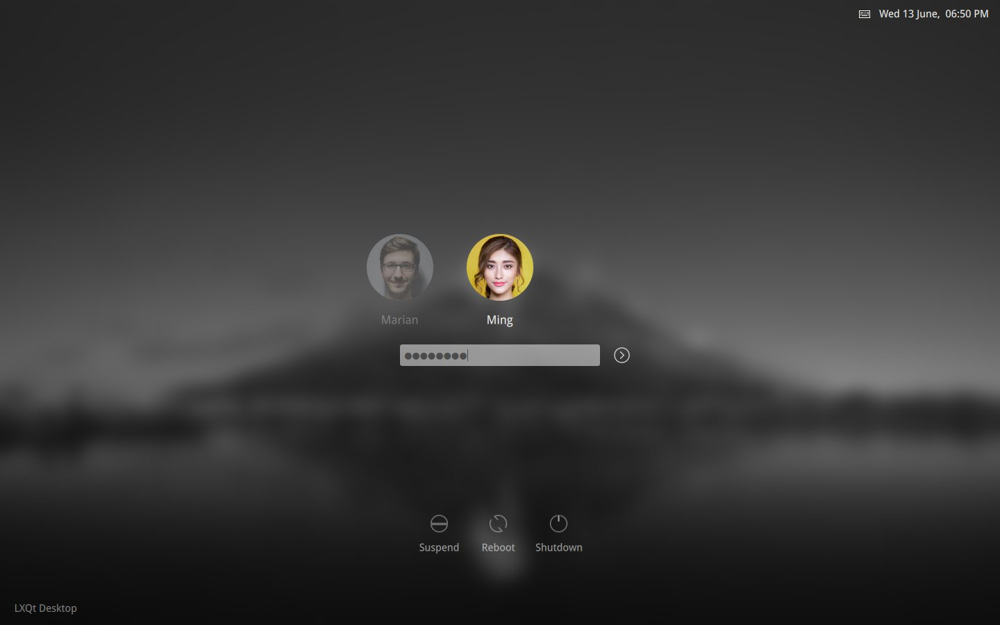

# Chili login theme for SDDM

Chili is hot, just like a real chili! Spice up the login experience for your users, your family and yourself. Chili reduces all the clutter and leaves you with a clean, easy to use, login interface with a modern yet classy touch.

Chili for SDDM is the desktop environment *independent* adaption of my chili login theme for [KDE Plasma](https://www.kde.org/plasma-desktop) with *reduced functionality*. If you use Plasma as your desktop environment you would likely prefer [Chili for KDE Plasma](https://github.com/MarianArlt/kde-plasma-chili).

### Dependencies

None. Easy as that!  
*(SDDM pulls in Qt5 by default so you usually won't have to install any extra packages.)*


### Installing the theme

Go to [openDesktop.org](https://www.opendesktop.org/p/1214121), download the archive and extract the contents to the theme directory of SDDM *(change the path for the downloaded file if necessary)*:
```
$ sudo tar -xzvf ~/Downloads/sddm-chili.tar.gz -C /usr/share/sddm/themes
```
This will extract all the files to a folder called chili inside of the themes directory of SDDM. After that you will have to point SDDM to the new theme by editing its config file:
```
$ sudo nano /usr/lib/sddm/sddm.conf.d/sddm.conf
```
In the `[Theme]` section set `Current=chili`. For a more detailed description please refer to the [Arch wiki on sddm](https://wiki.archlinux.org/index.php/SDDM). Note that, depending on your system setup, a duplicate configuration may exist in `/etc/sddm.conf`. Usually this takes preference so you want to set the above line in this file if you have it.

### Theming the theme

Chili is highly customizable through its included `theme.conf` file. You can alter the intensity of the background blur and even not have any blur at all. If you have a very big screen and the fonts have a weird size then fix it yourself in the config file. You can even change the avatar size to something that better suits you. And if that wasn't enough still you can translate the power buttons because SDDM is still lacking behind in translations!
  

  * Change the path of the background image relative to the theme directory:  
  `background=assets/background.jpg`  

  * Disable blur or play around with its intensity:  
  `blur=true`  
  `recursiveBlurLoops=4`  
  `recursiveBlurRadius=15`

  * Adjust the font size of the whole theme in one go:  
  *(Usually somewhere between 10 and 16, be careful)*  
  `changeFontPointSize=`

  * Adjust the size of the avatar image:  
  `changeAvatarPixelSize=`

  * Translate the labels of the power buttons:  
  `translationReboot=`  
  `translationSuspend=`  
  `translationPowerOff=`

You might see some grey pixels around your avatar image which is caused by the anti-aliasing of the opacity mask. You may change the fill color of the mask which resides in `assets/mask.svg` to a color that better matches with your avatar colors. Do **not** change the *opacity* of the mask! Take note that this might affect other avatar images with different colors present on your system.

### License

This project is licensed under the GPLv3 License - see the [LICENSE](LICENSE.md) for details

### Acknowledgments

Original code is taken from KDE plasmas breeze theme. In specific the breeze SDDM login theme written by [David Edmundson](davidedmundson@kde.org). I have rewritten a lot of the logic and layout though to make it work with just SDDM.

### Send me a coffee

In the past years I have spent quite some hours on open source projects. If you are the type of person who digs attention to detail, know how much work is involved in it and/or simply likes to support makers with a coffee or a beer I would greatly appreciate your donation on my [PayPayl](https://www.paypal.me/marianarlt) account.
